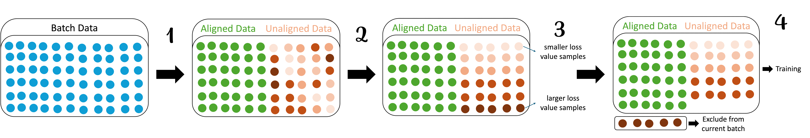

# RAPPO - Keep the Best, Forget the Rest: Reliable Alignment with Order-Aware Preference Optimization

This repository provides the official implementation​ of RAPPO, proposed in the paper [*Keep the Best, Forget the Rest: Reliable Alignment with Order-Aware Preference Optimization*](https://openreview.net/forum?id=LrHfYPFTtg). RAPPO (Reliable Alignment for Preference Policy Optimization) is a simple yet effective modification of the Direct Preference Optimization (DPO) loss. It addresses the sensitivity to noisy or ambiguous preference pairs by dynamically filtering out the most challenging samples during training, leading to more robust alignment and tighter generalization guarantees. The core pipeline is:
1. Sample a mini-batch of preference data.
2. Score each sample based on its alignment with a reference policy.
3. Split the batch into "aligned" (green) and "ambiguous" subsets as illustrated above, focusing the gradient signal on the more reliable samples.

## File Description
Our codebase is built upon the excellent [huggingface/trl](https://github.com/huggingface/trl). We are sincerely grateful to the Hugging Face team for this valuable resource.

Based on the original TRL framework, we have added the following key files to implement RAPPO:

+ `alg/rappo_trainer.py`: The core implementation of the RAPPO trainer.
+ `scripts/PKUSafeRLHF_launcher.py`: Training scripts for running RAPPO and baselines on the [PKU-Alignment/PKU-SafeRLHF](https://huggingface.co/datasets/PKU-Alignment/PKU-SafeRLHF) dataset.

## Installation & Usage

Installation and basic usage follow the same process as the original [huggingface/trl](https://github.com/huggingface/trl). Please refer to their documentation for detailed setup instructions on dependencies, environment, and distributed training.

## Citation
If you find RAPPO useful in your research, please cite our paper:
```bibtex
@inproceedings{zhu2026keep,
    title={Keep the Best, Forget the Rest: Reliable Alignment with Order-Aware Preference Optimization},
    author={Jiahui Zhu and Yuanjie Shi and Xiyue Peng and Xin Liu and Yan Yan and Honghao Wei},
    booktitle={The Fourteenth International Conference on Learning Representations},
    year={2026},
    url={https://openreview.net/forum?id=LrHfYPFTtg}
}
```


## License

This repository's source code is available under the [Apache-2.0 License](LICENSE).


<h1 align="center">
RAPPO: Keep the Best, Forget the Rest: Reliable Alignment with Order-Aware Preference Optimization
</h1>

<p align="center">
<a href="https://openreview.net/forum?id=LrHfYPFTtg&referrer=%5BAuthor%20Console%5D(%2Fgroup%3Fid%3DICLR.cc%2F2026%2FConference%2FAuthors%23your-submissions)">
  
</a>
<a href="LICENSE">
  
</a>
<a href="https://github.com/huggingface/trl">
  
</a>
<a href="https://huggingface.co/datasets/PKU-Alignment/PKU-SafeRLHF">
  
</a>
</p>

<p align="center">
Official implementation of <a href="https://openreview.net/forum?id=LrHfYPFTtg"><i>Keep the Best, Forget the Rest: Reliable Alignment with Order-Aware Preference Optimization</i></a>.
</p>

---

## Overview

**RAPPO (Reliable Alignment for Preference Policy Optimization)** is a simple yet effective modification of the **Direct Preference Optimization (DPO)** objective.
It improves robustness under **noisy / ambiguous preference pairs** by **dynamically filtering out the most challenging samples** during training, resulting in more reliable alignment and **tighter generalization guarantees**.

### Core idea (high-level)
1. Sample a mini-batch of preference data.
2. Score each sample by how well it aligns with a reference policy.
3. Split into **aligned** (reliable) and **ambiguous** (noisy/hard) subsets, then **focus gradients on reliable samples**.

<p align="center">
  
</p>

---

## What’s included

This codebase is built upon **[huggingface/trl](https://github.com/huggingface/trl)** (many thanks to the Hugging Face team!).

We add the following key components to implement RAPPO:

- **`alg/rappo_trainer.py`**  
  Core implementation of the RAPPO trainer.

- **`scripts/PKUSafeRLHF_launcher.py`**  
  Training launcher for running RAPPO and baselines on  
  **[PKU-Alignment/PKU-SafeRLHF](https://huggingface.co/datasets/PKU-Alignment/PKU-SafeRLHF)**.

---

## Installation

Installation and usage follow the same process as **TRL**.

- Please refer to the official TRL documentation for:
  - dependencies / environment setup
  - distributed training
  - model & tokenizer loading
  - logging & checkpointing

---

## Usage

### Train on PKU-SafeRLHF
Use the provided launcher:

- `scripts/PKUSafeRLHF_launcher.py`

> Notes:
> - The launcher is designed to run **RAPPO** as well as relevant **baselines**.
> - Please check the script arguments and TRL configs for model, batch size, LR, and distributed settings.

---

## File structure

```text
alg/
  rappo_trainer.py          # RAPPO trainer implementation
scripts/
  PKUSafeRLHF_launcher.py   # training launcher for PKU-SafeRLHF
```


## Citation
If you find RAPPO useful in your research, please cite our paper:
```bibtex
@inproceedings{zhu2026keep,
    title={Keep the Best, Forget the Rest: Reliable Alignment with Order-Aware Preference Optimization},
    author={Jiahui Zhu and Yuanjie Shi and Xiyue Peng and Xin Liu and Yan Yan and Honghao Wei},
    booktitle={The Fourteenth International Conference on Learning Representations},
    year={2026},
    url={https://openreview.net/forum?id=LrHfYPFTtg}
}
```


## License

This repository's source code is available under the [Apache-2.0 License](LICENSE).
